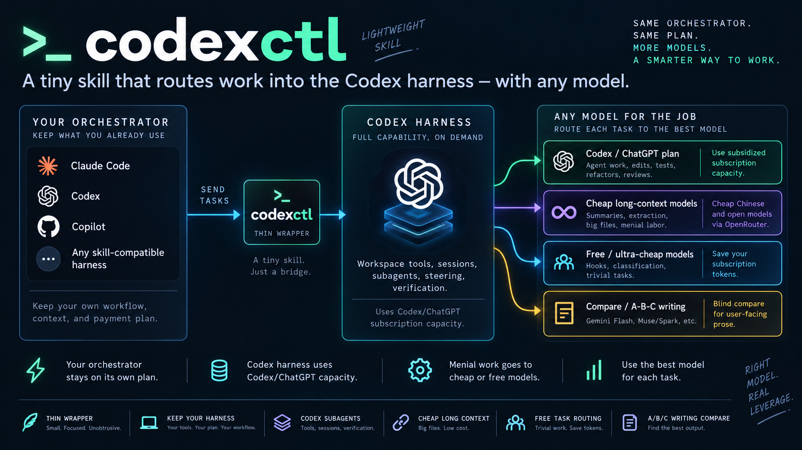

# codexctl

One CLI to route every model call to the cheapest place it can run.

`codexctl` is a skill that allows any SKILL compatible Harness to drive a local `codex app-server` control plane to orchestrate Codex sessions as subagents through their own shell/monitoring system. Your favorite Agent (Codex/ClaudeCode/Copilot) stays the orchestrator under your preferred payment plan. Subagents do agent work through Codex under their own plans. OpenRouter covers everything else: pay-as-you-go models to cheap inference open models for long menial jobs, `:free` endpoints for trivial calls. One command, one usage log, and a stripped-down prompt that makes tiny calls actually tiny.



```
node scripts/codexctl.js run "Add unit tests for src/parser.ts and run them"
node scripts/codexctl.js review --base main
node scripts/codexctl.js ask deepseek --file huge.log "List every error class"
node scripts/codexctl.js ask free --file notes.md "Reformat this as a markdown table"
node scripts/codexctl.js compare "Write a launch tweet for this release. Plain, no hashtags."
```

## Why this exists

Most setups run everything through one frontier model: the architecture call, the refactor, the summary of a giant log, the hook classifying a commit message. Same quota, same rate, whatever the difficulty.

But i've found it best when using Fable to manage fleets of subagents of Astra, with both the main Claude session and the subagents having the capability to invoke their own subagents. This allows independent compaction, complex planning, lower token usage, and better long-term session management, especially when used with Codex's experimental memory mnagement features (ask codex how to enable it. It's a game changer)

codexctl tiers spend by how hard your own agent/harness thinks the work is:

| tier | runs here | paid how | command |
|---|---|---|---|
| Orchestrator | reading code, deciding, verifying | Any harness compatible model | Any Skill compatible harness |
| Agent work | edits, tests, refactors, reviews | ChatGPT/Codex plan quota | `run`, `resume`, `fork`, `review` |
| Menial long-context | summaries, extraction, reformat over big inputs | OpenRouter pay-as-you-go | `ask deepseek`, `map` |
| Trivial | hooks, classification, throwaway probes | OpenRouter `:free`, $0 | `ask free`, `run --model free` |
| Prose | copy you will publish, user facing docs, etc. | OpenRouter, three model A/B/C test | `compare` |

Two flat subscriptions cover the thinking. Pay-as-you-go covers volume. Free covers the long tail. A Claude session can delegate a refactor to Codex, have DeepSeek pull decisions out of a transcript, and let a free model answer a hook, without touching Claude's context or quota.

## Quick start

1. Install [Codex CLI](https://github.com/openai/codex) and log in with a ChatGPT plan.
2. Node 18 or newer.
3. Add OpenRouter to `~/.codex/config.toml`. This Codex version only speaks the Responses API:

```toml
[model_providers.openrouter]
name = "OpenRouter"
base_url = "https://openrouter.ai/api/v1"
env_key = "OPENROUTER_API_KEY"
wire_api = "responses"
```

4. Set `OPENROUTER_API_KEY`.
5. Clone this repo to `~/.claude/skills/codexctl`. Claude Code loads it from `SKILL.md`; the scripts also run standalone. Run with no arguments for full usage.

## Two kinds of call

**Agent** commands (`run`, `resume`, `fork`, `review`) use Codex's own prompt and tools in a workspace. Threads persist under `~/.codex/sessions`, so you can resume, fork into another model for a second opinion, `steer` a running turn, or `interrupt` it. Safety comes from the sandbox (`workspace-write` by default: writes inside cwd, no network), not from approval prompts, which codexctl auto-answers.

**Plain** commands (`ask`, `compare`, `map`) swap the agent prompt for `assets/plain.md`, run read-only in an ephemeral thread, and print text on stdout with a stats line on stderr. Any model works for either kind, including a free model as the agent.

```
# free model as the agent; the chain moves to the next model on 429
node scripts/codexctl.js run --model free --cwd . "Add a --dry-run flag and run its tests"

# chunks of a big file in parallel, cheap model with a free floor
node scripts/codexctl.js map --model cheap-chain --chunk 150000 --label --file transcript.txt "Extract every decision" --out decisions.md

# blind A/B/C, judged, then reveal who wrote what
node scripts/codexctl.js compare --models spark,flash,sonnet --blind --judge default "Write the product description ..."
node scripts/codexctl.js reveal latest

# long task in the background, steerable from another shell
node scripts/codexctl.js serve
node scripts/codexctl.js run --detach --model gpt-5.6-sol --effort medium "Port the build to pnpm workspaces"
node scripts/codexctl.js steer THREAD_ID "Also update the CI workflow"
```

## Which model

`--model` takes a Codex model, an alias, an `org/model` OpenRouter id, or a comma list. A list is a fallback chain: a turn that fails before producing anything retries on the next model. Built in: `free` (the `:free` models that completed a fix-and-verify agent task, fastest first) and `cheap-chain` (DeepSeek, Qwen, GLM, then `free`). Groups for `compare`: `prose` (spark, flash, sonnet), `cheap` (deepseek, qwen, glm), `free-all`. Defaults: `ask` is flash, `compare` is `prose`, `map` is deepseek.

| need | pick |
|---|---|
| quick edits, tests, scripts | `gpt-5.6-luna --effort low` (default) |
| medium refactors, reviews | `gpt-5.6-terra --effort medium` |
| harder reasoning, second opinion | `gpt-5.6-sol --effort high` |
| $0 agent work on throwaway or public code | `run --model free` |
| summaries, extraction, classification | `ask free`, then `ask cheap-chain` |
| whole-file input, per-section output | `ask deepseek --file F`, or `map` |
| published prose | `compare`, show A/B/C, let the human pick |

On short tasks effort mostly adds latency, not quality. `aliases` prints every alias, chain, and group.

## Why plain calls are cheap

A stock Codex request with connected ChatGPT apps carried ~490 KB per request in testing: 424 KB of tool schemas, 17 KB system prompt, 28 KB skills catalog. About 137k input tokens and ~10 s of upload before the model reads a word.

| mode | per request | what changed |
|---|---|---|
| stock Codex with apps | ~490 KB | baseline |
| `--lean` (default with `--provider`) | ~48 KB | connectors, sub-agents, browser and computer use dropped |
| `--instructions` / `--system` | ~15 KB | Codex prompt replaced with yours |
| `ask`, `compare`, `map` | ~7 KB | skills, plugins, permissions, environment dropped too |

A plain `ask flash` is ~1,000 input tokens and ~2 s wall clock. That is what makes whole-file reads and hook calls reasonable.

## Housekeeping

```
node scripts/codexctl.js usage          # plain-call spend, last 30 days
node scripts/codexctl.js limits         # ChatGPT quota, check before batch work
node scripts/codexctl.js models         # Codex models and efforts
node scripts/codexctl.js list --cwd .   # recent threads here
node scripts/codexctl.js delete THREAD  # tidy up
```

Plain calls log cost (from OpenRouter's catalog) to `~/.codexctl/usage.jsonl`. Codex turns bill against the ChatGPT plan.

## Caveats

- Free endpoints may log prompts and rate-limit. Never send private material there; keep it on paid or OpenAI models. Chains exist because some `:free` models 429 all day.
- Never start a second turn on a running thread; it merges silently into the active turn. Use `steer`.
- Compaction is lossy and emits no event. After long threads, restate what matters.
- `--sandbox danger-full-access` with `--approval never` is unrestricted host access. Only with explicit consent.
- Tested on Windows 11 with `codex-cli 0.153.4`. Some server features are Unix-only or blocked under the Windows sandbox. Details and measurements: [references/findings.md](references/findings.md).

## Layout

- [SKILL.md](SKILL.md) — skill entry point Claude Code loads
- [scripts/codexctl.js](scripts/codexctl.js) — the CLI
- [scripts/codexrpc.js](scripts/codexrpc.js) — JSON-RPC client for custom orchestration
- [scripts/gen-protocol.js](scripts/gen-protocol.js) — regenerates the protocol reference
- [assets/plain.md](assets/plain.md) — instructions plain calls use instead of the agent prompt
- [references/findings.md](references/findings.md) — verified behavior, prompt sizes, model probes
- [references/protocol.md](references/protocol.md) — generated method and parameter reference
